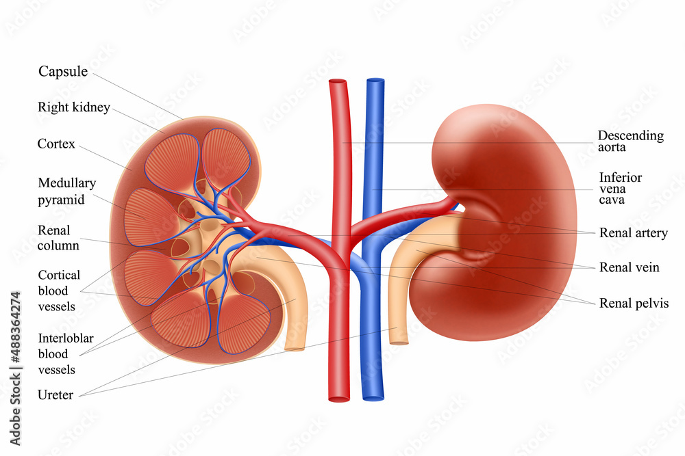

# Kidney: Weibull regression with random efects

**Context** : This project is part of a course entitled Bayesian methods and hierarchical models.

**Objective** : The objective of this study is to analyze time to first and second recurrence of infection in kidney patients on dialysis. The analysis uses a Weibull regression model with random effects and includes age, sex, and underlying disease as risk variables. The aim is to identify the risk factors associated with recurrence of infection in kidney patients.

## Project summary :

McGilchrist and Aisbett (1991) [1] analyse time to first and second recurrence of infection in kidney
patients on dialysis using a Cox model with a multiplicative frailty parameter for each individual.
The risk variables considered are age, sex and underlying disease (coded other, GN, AN and PKD). A portion of the data are shown below. 

|                |                   |                  |               |                  |                                             |
|----------------|-------------------|------------------|---------------|------------------|---------------------------------------------|
| Patient Number | Recurrence time t | Event (2 = cens) | Age at time t | Sex (1 = female) | Disease (0 = other; 1 = GN 2 = AN; 3 = PKD) |
| 1              | 8,16              | 1,1              | 28,28         | 0                | 0                                           |
| 2              | 23,13             | 1,2              | 48,48         | 1                | 1                                           |
| 3              | 22,28             | 1,1              | 32,32         | 0                | 0                                           |
| 4              | 447,318           | 1,1              | 31,32         | 1                | 0                                           |
| ..              | ..          | ..            | ..         | ..               | ..                                           |
| 35             | 119,8             | 1,1              | 22,22         | 1                | 1                                           |
| 36             | 54,16             | 2,2              | 42,42         | 1                | 1                                           |
| 37             | 6,78              | 2,1              | 52,52         | 1                | 3                                           |
| 38             | 63,8              | 1,2              | 60,60         | 0                | 3                                           |

## Sources : 
[1] Regression with Frailty in Survival Analysis
C. A. McGilchrist and C. W. Aisbett. Vol. 47, No. 2 (Jun., 1991)

[2]	OpenBUGS Project Management Group. OpenBUGS Examples Volume I. 2014. version 3.2.3. URL: http://www.openbugs.net/Examples/Volumei.html.

